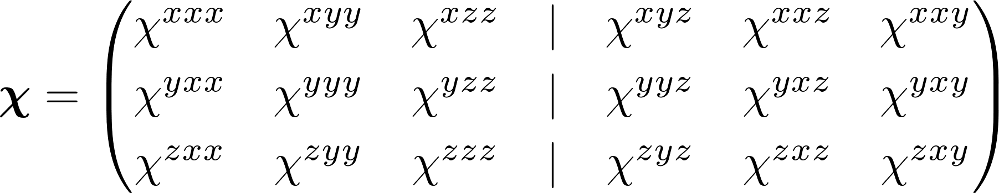

SHG Yield for Semiconductor Surfaces
====================================

SHGYield is a python program for calculating the surface second-harmonic generation (SSHG) yield (in reflectance) for semiconductor surfaces. 

Introduction
------------------------------------

SSHG is an effective, nondestructive, and noninvasive probe for studying surface and interface properties, and even for characterizing buried interfaces and nanostructures. The high surface sensitivity of SSHG spectroscopy is due to the fact that within the dipole approximation, the bulk SHG response in centrosymmetric materials is identically zero. The SHG process can occur only at the surface where the inversion symmetry is broken. 

This program has several potential applications and uses:
* determining and analyzing the physical origin of SSHG spectra
* predicting and characterizing the radiated SSHG for interesting new materials
* characterizing thin films based on measured SH spectra
* allowing the experimenter to calculate and analyze the SSHG yield to optimize experiments

For example, the figure below is an overview of the angular dependence of the reflected SHG Yield from the Si(111)(1x1)H surface. Experimentalists will find this very useful, as they can plan the experiment accordingly in order to optimize the output signal strength and polarization.

References
------------------------------------

The complete theory is derived step-by-step in [Phys. Rev. B 94, 115314 (2016)](https://doi.org/10.1103/PhysRevB.94.115314). This software has been developed and used in the following publications:

* [Front. Mater. 4:12 (2017)](https://doi.org/10.3389/fmats.2017.00012)
* [Phys. Rev. B 94, 115314 (2016)](https://doi.org/10.1103/PhysRevB.94.115314)
* [Phys. Rev. B 93, 235304 (2016)](https://doi.org/10.1103/PhysRevB.93.235304)
* [Phys. Rev. B 91, 075302 (2015)](https://doi.org/10.1103/PhysRevB.91.075302)
* [arXiv:1604.07722 (2016)](https://arxiv.org/abs/1604.07722)
* [Theoretical Optical Second-Harmonic Calculations for Surfaces (2016)](https://doi.org/10.13140/RG.2.2.35619.66082)

Installation
------------------------------------

SHGYield has been tested with Python 2 and 3, and Anaconda Python 4+ on both macOS and Linux. It should work on any system (including Windows) with the required Python packages installed.

Python requirements:
`sys`, `yaml`, `numpy`, `scipy`

Usage:
`python shgyield.py <input.yml>`

You can find a very complete input file inside the `example` directory.

Example and tutorial
------------------------------------

An example case using the Si(111)(1x1):H surface is included in the `example` directory. It includes a very complete input file, all the components of the susceptibility tensor, and some reference data with relevant plots.

Also included is a Jupyter notebook with a brief but thorough tutorial that explains some the of the theory and how the equations are coded. This tutorial walks the user through the battery of calculations required for the SSHG yield for this surface.

Testing
------------------------------------

A test script is included in the `tests` directory, and can be run automatically with `pytests`. Read the `README.md` file in that directory for details.

Theory
------------------------------------

SHGYield.py produces the SHG radiation (in reflectance) produced from a semiconductor surface. It requires the susceptibility tensors that can be calculated as explained below. The theory is developed considering a reflectance model with three distinct regions that allows the user to readily simulate the SHG response of thin-films over bulk substrates, or of any crystalline surface with any symmetry considerations. 

In order to calculate the SHG yield, you must first calculate the linear and nonlinear susceptibility tensor (<b><i>χ</i></b>(−2ω; ω, ω), <b><i>χ</i></b> for short) for the material of interest. The theory surrounding this problem is still being developed, and there are many ways to go about it. We leave it to the reader to find the best method for their particular problem. As an example, we use [ABINIT](http://www.abinit.org) to calculate the electron density/wavefunction/energies and then [TINIBA](https://github.com/bemese/tiniba) to calculate the relevant matrix elements and the <b><i>χ</i></b> tensor components. The exact method that we use is derived in full detail in [Phys. Rev. B 91, 075302 (2015)](https://doi.org/10.1103/PhysRevB.91.075302). The program does NOT care how you have produced the susceptibility tensors; you can use different frameworks (such as MBPT, DFT-LDA, TDDFT, etc.) for producing the linear and nonlinear susceptibility tensors. 

### The nonlinear susceptibility tensor, <i>χ</i>(−2ω; ω, ω)

<b><i>χ</i></b> determines the nonlinear polarizability of a material and is responsible for second-harmonic generation. This relationship is expressed as

where a, b, and c are crystallographic directions that depend on how you orient your crystalline structure. We can see that a material can produce a polarization response in direction a from two incident fields (<i>E</i>) in directions b and c, by means of <i>χ</i>abc.

<b><i>χ</i></b> is a third-rank tensor, and thus has 27 possible components (unique combinations of a, b, and c; for instance, aaa, aab, and so on.). Second-harmonic generation implies that the incoming fields are identical (two photons of equal energy in, one photon of double-energy out) so it is also implied that 

for this particular phenomenon. This reduces 9 of the possible combinations, reducing to 18 unique components. It is very convenient to express the crystallographic directions in terms of *x*, *y*, and *z*; therefore, we can express <b><i>χ</i></b> with all 18 components as

Symmetry relations are very important for determining <b><i>χ</i></b>. A given crystal symmetry can greatly reduce the complexity of the problem by eliminating many of the components. For instance, for the (001) face of cubic crystals, we have that

which has only 3 independent components. There are many [articles](https://journals.aps.org/prb/abstract/10.1103/PhysRevB.35.1129) and [books](https://books.google.com/books?id=bdFju3af2FsC) with tables and extensive discussion that describe the form that this tensor should have for a given symmetry.

### The linear susceptibility tensor

The case for <i>χ</i>ab(ω) is considerable simpler. <i>χ</i>ab(ω) is directly related to the dielectric function of the material

which is directly related to the index of refraction as

The <i>χ</i>ab(ω) spectra should obviously have non-zero regions; otherwise, the problem is not very interesting.

### Calculating the electronic properties of semiconductors

In general, there are several *ab initio* formalisms that can be used to obtain the electron density/wavefunction/energies of crystalline semiconductor materials. The most common are:

* all-electron methods (older, declining in popularity)
* density functional theory with the local-density approximation (DFT-LDA) (solid workhorse with known problems)
* time-dependent density functional theory (TDDFT) (good for optical responses, but hard to implement)
* many-body perturbation theory (MBPT) (state-of-the-art, but extreme computational expense)

Each of these has their pros and cons that mainly relate to accuracy vs. difficulty of the theory vs. computer resources. There are [many free and open-source codes](http://psi-k.net/software/) available for download that are under active development by thousands of researchers and groups.

### Calculating the susceptibility tensors and optical properties

Once the initial electronic properties of the material are determined, we can then proceed to calculate the optical properties that include the linear and nonlinear responses. In general, nonlinear optics is now pretty well understood within the DFT-LDA (see references within [Phys. Rev. B 91, 075302 (2015)](https://doi.org/10.1103/PhysRevB.91.075302)) and the [TDDFT](http://dx.doi.org/10.1063/1.2790014) frameworks. MBPT is currently (AFAIK) still at the linear optics level, but has the highest level of accuracy available. Of course, you can combine different methods to exploit the strengths that each has to offer. 

The code that we use is called [TINIBA](https://github.com/roguephysicist/tiniba); however, we have not yet created an official release for production use. That said, we are an active research group that uses this software every day to produce high-quality scientific work, and are constantly improving and adding features to it. Publishing TINIBA is definitely a long-term goal that we have.

There are, however, some codes available, such as [RT-SIESTA](http://monalisa.phys.washington.edu/feffproject-rtsiesta.html) which works with TDDFT, and even [ABINIT](http://www.abinit.org/doc/helpfiles/for-v8.2/users/optic_help.html) has built-in utilities for calculating the susceptibility tensors.

License
------------------------------------

Copyright 2017 [Sean M. Anderson](mailto:sma@cio.mx) and [Bernardo S. Mendoza](mailto:bms@cio.mx).

SHGYield is free software made available under the BSD-3-Clause License. For details please see the LICENSE file.
