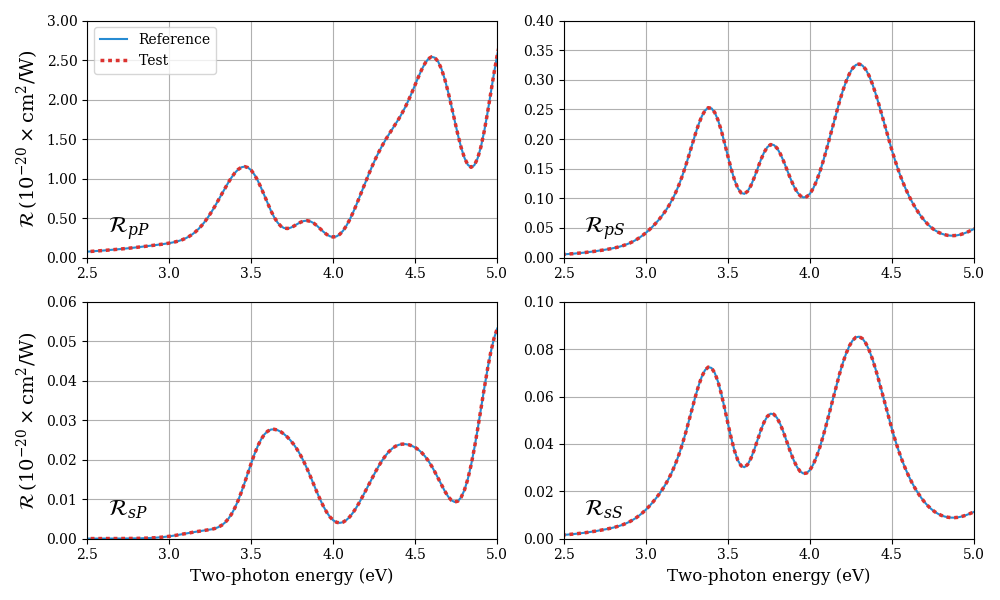

Testing
======================================

Usage:
`python test.py`

Python requirements:
`sys`, `yaml`, `numpy`, `scipy`, `matplotlib`

This will run the `shgyield.py` program on `test.yml` to produce a sample dataset. It then uses matplotlib to plot the produced dataset against a reference. These curves should yield identical results. This should look something like this:

